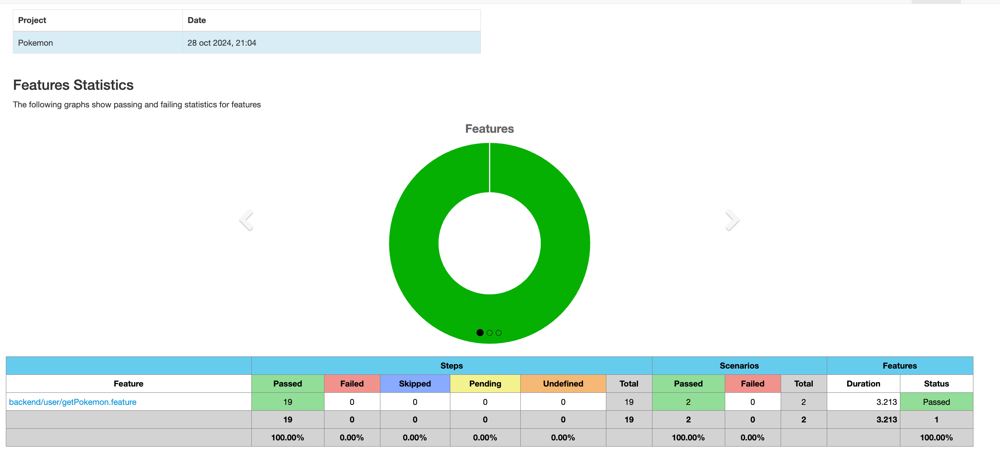

# 🚀☄️QA - Automation - pokemon_API


---

## 📄 Description

This project focuses on the automation testing of the Pokemon API, a hosted dummy REST API designed for testing purposes. It utilizes the powerful Karate framework, which is a Cucumber-like Behavior-Driven Development (BDD) framework specifically designed for API automation testing. The project leverages Maven as the dependency manager, ensuring a structured and efficient management of project dependencies, We aim to ensure the reliability and quality of the API endpoints, reducing the risk of regressions and improving the overall development process.

---

## ⚙️ Requirements

- Java (version 21.0.2 or later)
- Maven (version 3.9.6 or later)

---

## 🔌 Plugins Used

- [Karate](https://github.com/intuit/karate) - Cucumber-like Behavior-Driven Development (BDD) framework for API automation testing
- [Cucumber](https://cucumber.io/) - Software tool for testing other software
- [Maven](https://maven.apache.org/) - Build automation tool and dependency management system

---

## 🚀 Installation

1. Clone the repository:

    ```bash
    git clone -b automation https://github.com/emielesG04/pokemon_API/tree/feature_squirtle
    cd ReqResKarate_backend
    ```
2. Compile the project:

    ```bash
    mvn clean install
    ```

---

## 🗂 Project Structure

```
└───ReqResKarate_backend
    ├───.idea
    └───src
        └───test
            ├───java
            │   └───backend
            └───resources
                └───backend
                    └───getPokemon
```

---

## 🏃‍♂️ Usage

1. **Running Tests**:Running Tests: using the runner file located on src/test/java/backend/testParallel.java command will run
   all the features exposed in the project and generate the proper reports

## Reporting

1. **Cucumber Reporting**:after running the tests using the runner previously discussed a test report made with cucumber will be
   generated in the **target/cucumber-html-reports** route, and results can be further viewed in the newly generated cucumber overviews,
   An example of the results is shown below:

